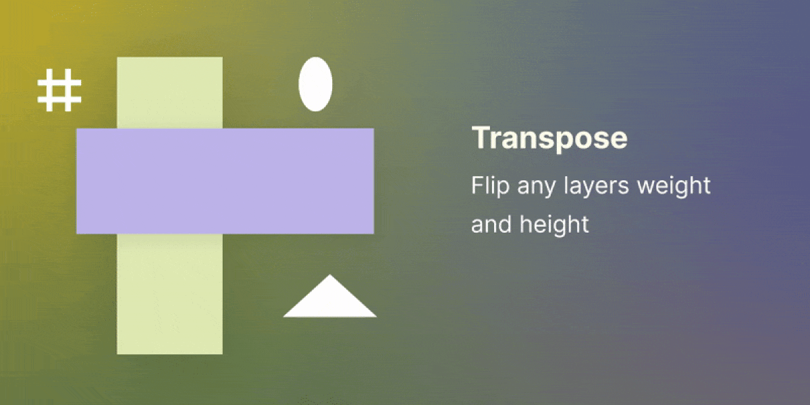

<h1 align="center"></h1>

  A simple figma plugin to flip any layers size.

 

# Installation

Click bellow to direct install from figma community

# Usage

## 1. Transpose > Each one

Select One (1) or more layers and run the plugin.

 

## 2. Transpose > Grouped

Text Text Text Text Text Text  
Text Text Text Text Text Text

 

> ## Tips : Launch plugins actions with custom keyboard
>
> For **Mac users** it is possible to associate natively a
> keyboard shortcut to your figma plugin from settings
> -learn more in this [youtube videos](https://www.youtube.com/watch?v=r-6q1AJNeTQ) or use
> [this method](https://www.youtube.com/watch?v=hkbTDbXc5Ng) for **Windows users**.

# Object handled

- RECTANGLE
- ELLIPSE
- POLYGON
- TEXT
- SHAPE_WITH_TEXT
- GROUP
- FRAME
- COMPONENT/ INSTANCE

# Support

Do you find this plugin useful ?   please consider to make a donation to support 🙏🏼

# Code

## Quick Setup

- Clone the repository.
- `npm install` installs all the dependencies.
- `npm build` builds and bundles the plugin.
- Import manifest into Figma and test.

### Contribution

Contributions are welcomed, feel free to make a pull request or create an issue

# Credits and Thanks

V2 - Maker : [@mrstev3n](https://github.com/mrstev3n),
V2 - Tester : [@rickfaf](https://github.com/rickfaf)

- Plugin with parameters : Transpose, each one | grouped

V1 - Maker : [@mrstev3n](https://github.com/mrstev3n)

- Run-once plugin with simple flip action

Big thanks to [@boussarilatif](https://github.com/boussarilatif) & [@rickfaf](https://github.com/rickfaf) for support, testing and code snippets   useful for the proper functioning of the plugin.

 

# Other Links

## License

© 2021 Steven Houessou-adin

